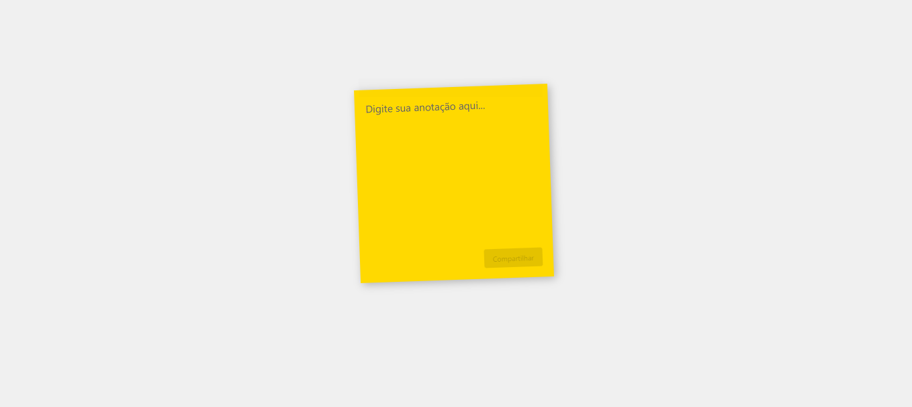
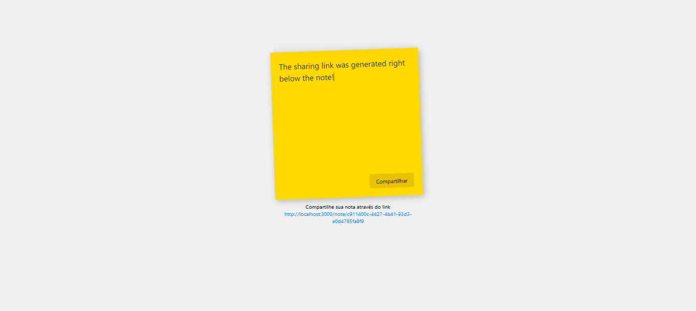

<h1 align="center"> 
Post It Share
</h1>

<p align="center">
⚙️ Desenvolvimento de um aplicativo Full-Stack de Post-It Temporário. ⚙️
</p>

<br>

## 💻 Sobre o projeto

O projeto consiste em um aplicativo Full-Stack de Post-It Temporário. Onde o usuário pode criar um post-it temporário e compartilhar com outros usuários.

<p>
  
</p>
</br>
<p>
  
</p>

<br>

## 🛠 Tecnologias

Esse projeto foi desenvolvido com as seguintes tecnologias:

- **[pnpm](https://pnpm.io/)**
- **[NodeJS](https://nodejs.org/en/)**
- **[Express](https://expressjs.com/pt-br/)**
- **[sqlite3](https://www.sqlite.org/index.html)**

<br>

## 🚀 Como executar

```bash
# Clone este repositório
$ git clone https://github.com/cirobatsilva/Post-it-Share.git
# Acesse a pasta do projeto no seu terminal/cmd
$ cd Post-it-Share
# Instale as dependências
$ pnpm install
# Execute a aplicação em modo de desenvolvimento
$ pnpm dev
# O servidor inciará na porta:3000 - acesse <http://localhost:3000>
```

<br>

## 📝 License

<p align="center">
  
</p>
<p align="center">Esse projeto está sob a licença MIT.</p>

<br>

### 👨‍💻 Autor

 
 <em>Ciro Batista da Silva<em>
 
 <br/>

 <p>👋🏽 Entre em contato!</p>

[](https://twitter.com/CiroSilva2020) [](https://www.linkedin.com/in/ciro-batista-da-silva-8b6838205/)
[](mailto:cirofight@gmail.com)
